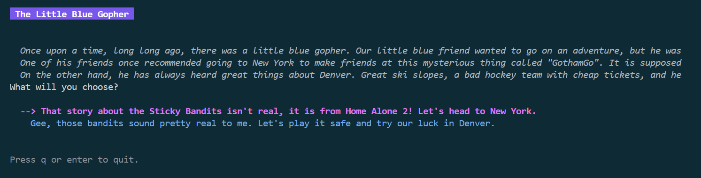
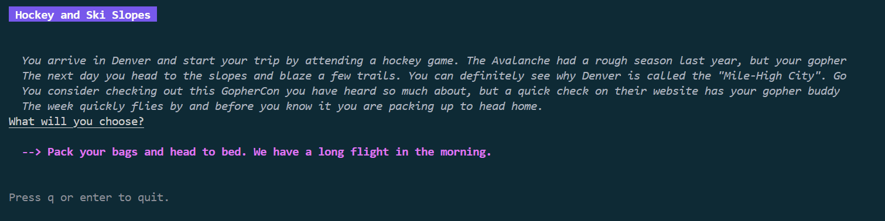
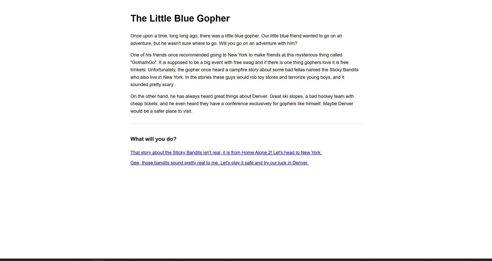
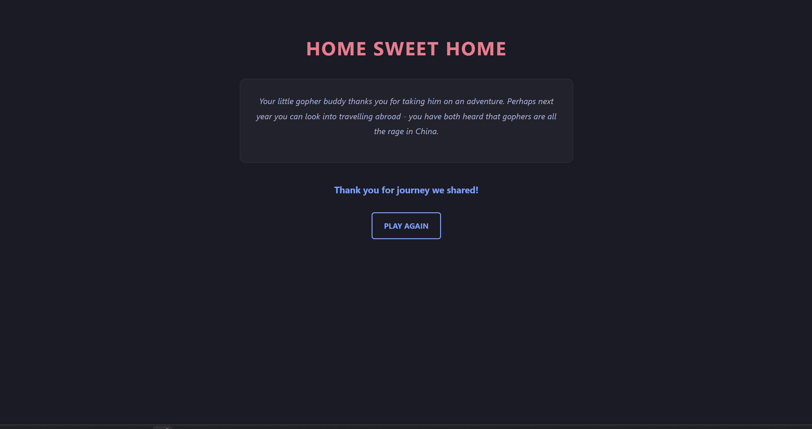

# chyoa — Choose Your Own Adventure (Go)

[](https://github.com/Cryezidl/chyoa/actions/workflows/ci.yml)

A "Choose Your Own Adventure" engine written in Go. A story is described as plain JSON
(chapters, paragraphs, and branching options), and the same story file can be played in
two different ways:

- **CLI** — an interactive terminal UI built with [Bubble Tea](https://github.com/charmbracelet/bubbletea)
- **Web** — an HTTP server built with [chi](https://github.com/go-chi/chi) that renders the story as HTML pages

## Features

- Story format is just JSON — write your own adventure without touching Go code
- Terminal player with arrow-key navigation, styled with Lip Gloss
- Web player exposing a simple REST-ish route (`/api/v1/cyoa/{chapter}`)
- Clean separation between the story engine (`cyoa`), delivery (`cli`, `web`) and entry points (`cmd`)

## Screenshots

### Terminal (CLI)

| Intro chapter | A later chapter |
| --- | --- |
|  |  |

### Web

| Story page | The End page |
| --- | --- |
|  |  |

## Project structure

```
.
├── cmd/
│   ├── cyoa-cli/     # CLI entry point (Cobra commands)
│   └── cyoa-web/     # Web server entry point
├── cli/              # Terminal UI (Bubble Tea model)
├── cyoa/             # Core engine: story model + JSON loader
├── web/              # HTTP handler + HTML templates
│   └── templates/
├── gopher.json       # Example story
└── go.mod
```

## Getting started

### Requirements

- Go 1.24+

### Clone & build

```bash
git clone https://github.com/Cryezidl/chyoa.git
cd chyoa
go build ./...
```

### Play in the terminal

```bash
go run ./cmd/cyoa-cli -p ./gopher.json play --sa intro
```

- `-p`, `--path` — path to the story JSON file (defaults to `gopher.json`)
- `--sa` — the chapter (arc) to start from (defaults to `intro`)

Controls: `↑`/`k` and `↓`/`j` to move between options, `Enter`/`Space` to choose, `q` to quit.

### Play in the browser

```bash
go run ./cmd/cyoa-web --filepath gopher.json
```

The server starts on `:8080`. Open a chapter directly:

```
http://localhost:8080/api/v1/cyoa/intro
```

Each page renders the chapter's text and a list of links to the next chapters. A chapter
with no options renders the "The End" page.

## Development

Run the checks that CI runs:

```bash
gofmt -l .          # should print nothing
go vet ./...
go test -cover ./...
```

The `cyoa` (engine), `cli` (terminal model) and `web` (HTTP handler) packages are unit
tested. Every push and pull request against `main` is verified by the
[CI workflow](.github/workflows/ci.yml).

## Story format

A story is a JSON object where each key is a chapter ID, referenced from `Options[].Arc`:

```json
{
  "intro": {
    "title": "The Little Blue Gopher",
    "story": [
      "Once upon a time, there was a little blue gopher...",
      "Will you go on an adventure with him?"
    ],
    "options": [
      { "text": "Yes, let's go!", "arc": "adventure" },
      { "text": "No, stay home.", "arc": "stay-home" }
    ]
  },
  "adventure": {
    "title": "The Adventure Begins",
    "story": ["..."],
    "options": []
  }
}
```

See [`gopher.json`](./gopher.json) for a complete example.

## Roadmap

- [x] Unit tests for the `cyoa`, `cli` and `web` packages
- [x] GitHub Actions workflow (`gofmt`, `go vet`, `go build`, `go test`)
- [ ] HTML templates for the CLI's missing-chapter case (currently web-only)
- [ ] Optional: persist player progress between sessions

## License

[MIT](./LICENSE)
